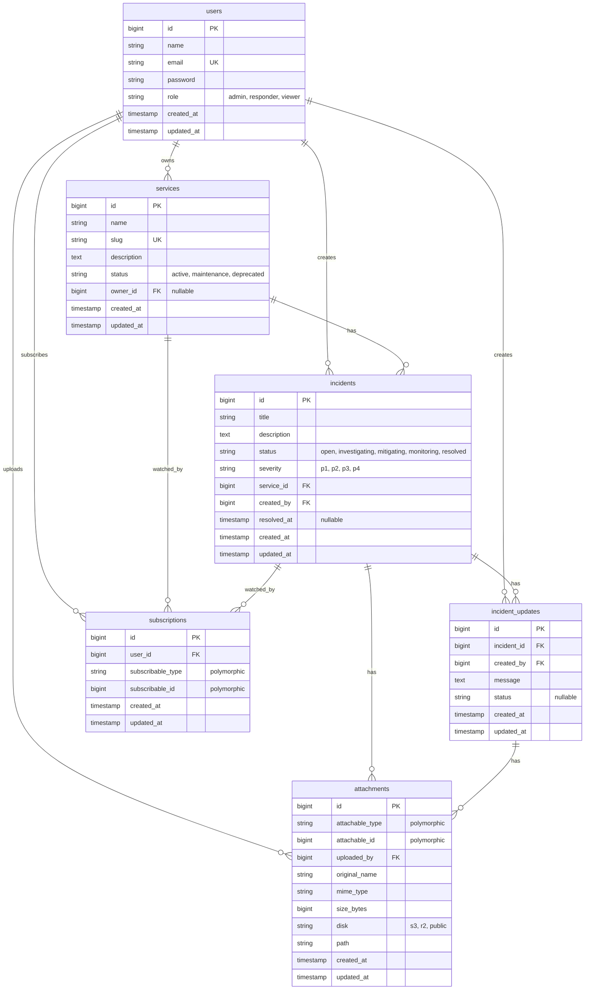

# Database Schema

This diagram shows the complete database structure for the Incident Tracker application.

## Key Relationships

### One-to-Many
- **User** → Services (owner)
- **User** → Incidents (creator)
- **User** → Incident Updates (creator)
- **Service** → Incidents

### Polymorphic (One-to-Many)
- **Attachments** can belong to:
  - Incidents (`attachable_type` = 'App\Models\Incident')
  - Incident Updates (`attachable_type` = 'App\Models\IncidentUpdate')

- **Subscriptions** can belong to:
  - Services (`subscribable_type` = 'App\Models\Service')
  - Incidents (`subscribable_type` = 'App\Models\Incident')

## Indexes

- **services**: `status`, `slug` (unique)
- **incidents**: `status`, `severity`, `created_at`, `service_id`, `created_by`
- **incident_updates**: `incident_id`, `created_at`, `created_by`
- **attachments**: `[attachable_type, attachable_id]` (auto-created by morphs)
- **subscriptions**: `[user_id, subscribable_type, subscribable_id]` (unique), `[subscribable_type, subscribable_id]` (auto-created by morphs)

## Cascade Behaviors

- When a **Service** is deleted → all related Incidents are deleted (cascade)
- When an **Incident** is deleted → all Updates and Attachments are deleted (cascade)
- When a **User** is deleted:
  - Their owned Services set `owner_id` to NULL
  - Their created Incidents, Updates, and Attachments are deleted (cascade)
  - Their Subscriptions are deleted (cascade)
